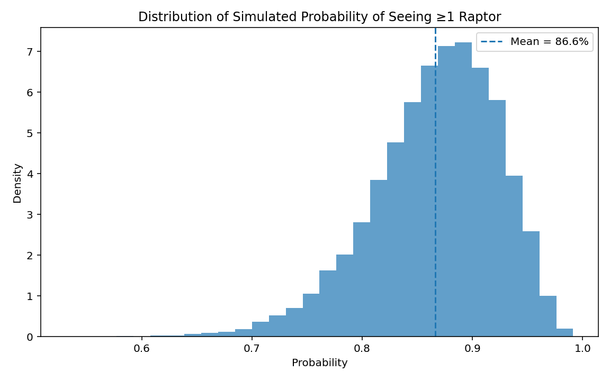
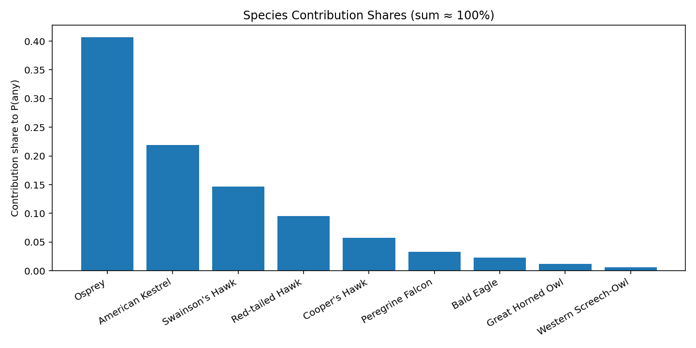

# Raptor Sighting Model

[](./LICENSE)

What it does (in plain words)
- Estimates the chance you’ll see at least one raptor on a Boise Greenbelt walk.
- You provide context (month, time of day, weather, route mix, duration, party size, and optional personal checklists). The model simulates many plausible days and reports the average probability, credible interval, and top contributing species.

Quick start
- Help: `python3 raptor_model_advanced.py --help`
- Example: `python3 raptor_model_advanced.py --month 8 --time_of_day dawn --plot --report_json out.json --report_csv species.csv`
- Reproducible smoke test: `python3 raptor_model_advanced.py --seed 123 --n_sims 5000`

Install
- Python: 3.9–3.12 recommended. 3.13 works with newer numpy/matplotlib (handled by requirements).
- Create venv: `python3 -m venv .venv && source .venv/bin/activate`
- Runtime deps: `pip install -r requirements.txt`
- Dev/test deps: `pip install -r requirements-dev.txt`

On macOS if you hit build errors (Python 3.13)
- Option A (simplest): use a 3.12 venv
  - `brew install python@3.12`
  - `python3.12 -m venv .venv && source .venv/bin/activate`
  - `pip install -r requirements.txt`
- Option B: stay on 3.13 with the updated requirements (this repo supports it), then:
  - `pip install --upgrade pip setuptools wheel`
  - `pip install -r requirements.txt`

## Usage Examples
- Basic August dawn walk with plots and reports:
  ```bash
  python3 raptor_model_advanced.py \
    --month 8 --time_of_day dawn --plot \
    --report_json out.json --report_csv species.csv
  ```
  Example console output (values vary by inputs/seed):
  ```
  Mean probability of seeing ≥1 raptor: 45.2%
  90% credible interval: 33.1% – 57.6%
  Odds of success: 0.83:1
  Factors: duration_effect≈1.46h, time_phase=dawn, ...
  Top contributors (share of overall P(any)):
    - Osprey                share=41.2%  P(≥1) mean=29.5%  CI[20.1%,39.3%]
    - American Kestrel      share=21.8%  P(≥1) mean=17.8%  CI[12.0%,24.5%]
    ...
  ```

- Custom route and per-species breakdown:
  ```bash
  python3 raptor_model_advanced.py \
    --route "river=0.8,park=0.1,woodland=0.1" \
    --time_of_day midday --month 9 --explain_per_species
  ```

- Personal checklist updates (Beta–Binomial):
  ```bash
  python3 raptor_model_advanced.py \
    --user_obs "Osprey=4/12,American Kestrel=2/10" --seed 123 --n_sims 5000
  ```

Core idea (the model in brief)
- Priors: Each species has an August probability of ≥1 seen in ~1 hour. We model uncertainty with a Beta prior of strength `k`. You can update with your own data via `--user_obs` (Beta–Binomial).
- Hazard scale: Convert a sampled probability `p` to a Poisson rate `λ = -ln(1 - p)`. Rates add across species and are where we apply scenario multipliers.
- Multipliers on λ: time-of-day (baseline × group modifier), smooth weather factor with group elasticity, habitat suitability from your route vs a baseline route, month seasonality normalized to August, party-size boost (saturating), duration exposure with diminishing returns `E = (duration/base)^gamma`, plus a shared day-quality factor `Q ~ LogNormal` with E[Q]=1 to couple species.
- Outcome: For each draw, adjusted rates λ′ yield `P(any) = 1 − exp(−Σ λ′)` and per-species marginals `1 − exp(−λ′)`. Contribution shares approximate how much each species drives `P(any)`.

Inputs and intuition
- Month/season: Peaks vary by species; values are relative to August baselines.
- Time of day: Dawn/dusk generally help; owls prefer night; soaring hawks tolerate midday.
- Weather: Thermals (temperature, moderate wind, some sun) help soaring species; heavy precip hurts.
- Route: More river boosts Osprey/Eagles; woodland helps Accipiters.
- Party size and duration: Help, but with diminishing returns.

Outputs and interpretation
- Console: mean probability, credible interval, odds, top contributing species. Add `--explain_per_species` for factor breakdowns.
- Plots: `raptor_prob_dist.png` and `raptor_contributions.png` via `--plot`.
- Reports: JSON summary (`--report_json`) and per-species CSV (`--report_csv`).

Screenshots
- Example distribution (illustrative):
  
  
  Generated with: `python3 raptor_model_advanced.py --seed 123 --n_sims 20000 --month 8 --time_of_day dawn --plot`.

- Example species contribution shares (illustrative):
  
  
  Same run as above (August, dawn, seed 123); shows species driving P(any).

Contributing
- See `CONTRIBUTING.md` and `AGENTS.md` for project conventions and PR guidelines.

License
- MIT License. See `LICENSE` for details.

## Acknowledgements
- Bird data, taxonomy, and regional insights:
  - eBird (Cornell Lab): https://ebird.org
  - IdahoBirds.net: http://idahobirds.net
  - Western Field Ornithologists: https://westernfieldornithologists.org
  - International Ornithological Committee: https://www.internationalornithology.org
  - The Peregrine Fund: https://www.peregrinefund.org
  - Make Like An Apeman (field reports/blog): https://www.makelikeanapeman.com
- Local context and routes:
  - Visit Boise: https://www.visitboise.com
  - Visit Idaho: https://visitidaho.org
  - City of Boise: https://www.cityofboise.org
  - Bureau of Land Management (BLM): https://www.blm.gov
- Weather and climate references:
  - U.S. Climate Data: https://www.usclimatedata.com
  - AccuWeather: https://www.accuweather.com
  - Weather Underground: https://www.wunderground.com

AI tools
- This project benefited from drafting, refactoring, and documentation help informed by Grok, GPT-5 Pro, and Codex.

Architecture and key functions
- File: `raptor_model_advanced.py` (single-file CLI + model).
- `run_simulation()`: Vectorized Monte Carlo; composes per-species λ′ and `P(any)`.
- `summarize()`: Aggregates means, credible intervals, and contribution shares.
- `weather_factor_rate_smooth()` / `time_factor_baseline()`: Scenario multipliers.
- `parse_user_obs()` / `parse_keyvals()`: Robust CLI parsing for personal checklists and route mix.

Tips
- Use `--seed` for reproducibility and `--n_sims` to trade speed vs. precision.
- Run `--sensitivity` to see directional “what-ifs”.

## Running Tests
- Install pytest in your venv: `pip install pytest`
- Run all tests: `pytest -q`
- Fast subset (by file): `pytest -q tests/test_factors.py`

## Model Math (Appendix)
- Symbols: `p_i` = base probability of ≥1 for species i (August, ~1h). `λ_i = -ln(1-p_i)` (Poisson rate). `Q` = shared day-quality `LogNormal(mu=-0.5σ², σ)`, so E[Q]=1. `E = (duration/base)^γ` (exposure). `F_party` = party-size factor. `W_base` = weather factor; species elasticity applies as `W_i = W_base^{elasticity(group_i)}`. `T_base` = time-of-day baseline; `T_i = T_base * modifier(group_i, phase)`. `H_i` = habitat suitability ratio (route vs. baseline). `S_i` = seasonality relative to August.
- Adjusted rate per draw: `λ′_i = λ_i × Q × E × F_party × W_i × T_i × H_i × S_i`.
- Overall success: `P_any = 1 − exp(−Σ_i λ′_i)`.
- Marginal per species: `P_i = 1 − exp(−λ′_i)`.
- Contribution weight: `w_i = λ′_i / Σ_j λ′_j` (interpretable as “first sighting share” under Poisson superposition). Shares in the summary are proportional to E[P_any × w_i].
- Priors and updates: Each species prior is Beta(mean, k). With personal checklists `seen/total`, posterior is Beta(alpha+seen, beta+(total-seen)).
